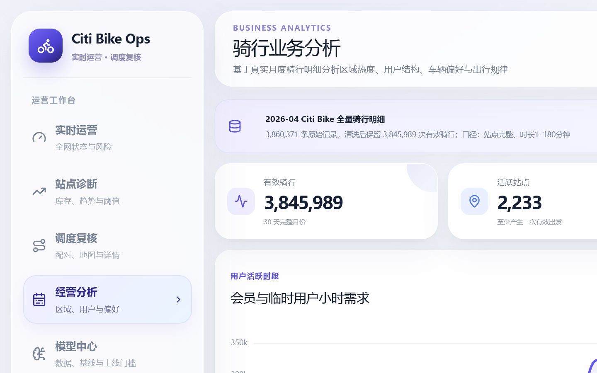
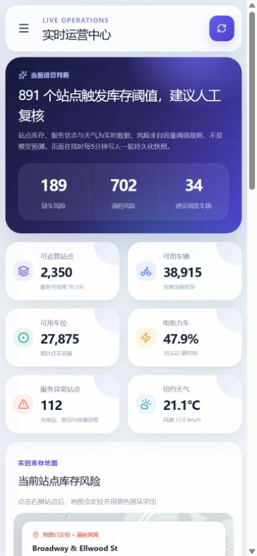

# Citi Bike Operations Monitor

> Citi Bike 实时运营与调度看板


基于 Citi Bike 官方 GBFS 实时站点状态、月度骑行明细和 Open-Meteo 天气数据构建的运营监控项目。系统关注一个具体问题：车辆是否在正确的时间出现在正确的站点，并把实时库存、异常诊断、规则告警、调度复核和历史经营分析整合到同一套网页中。

本项目当前使用可解释的库存阈值与距离规则生成风险和调度候选，不把规则结果包装成机器学习预测。

**在线体验：** [Citi Bike Operations Monitor](https://bikeflow-ai-nyc.bennett-mcleodngq.chatgpt.site)

## 项目截图

### 实时运营中心


### 多维经营分析



### 手机端适配



## 项目状态

| 能力 | 当前状态 | 说明 |
| --- | --- | --- |
| GBFS 实时站点状态 | 已实现 | 服务端获取可用车、空车位、故障车和服务状态 |
| 天气数据 | 已实现 | 获取温度、降雨和风速，用于实时展示与历史关系分析 |
| 历史骑行分析 | 已实现 | 基于 2026-04 Citi Bike 月度骑行明细生成可复核聚合结果 |
| D1 快照 | 已实现 | 页面在线时按 5 分钟时间桶保存系统及高风险站点快照 |
| 调度候选 | 已实现 | 根据目标库存、富余库存和站点直线距离生成待人工复核配对 |
| 24×7 后台采集 | 尚未实现 | 需要在公开部署时增加 Cron Trigger |
| 在线需求预测模型 | 尚未实现 | 未训练或部署 LightGBM，不展示虚构预测指标 |
| 道路路径优化 | 尚未实现 | 当前距离为经纬度直线距离，不代表实际道路里程 |

## 业务问题

共享单车运营的核心不是系统一共有多少辆车，而是站点在用户需要借车或还车时是否具备服务能力：

- 站点无车：用户无法开始骑行；
- 站点无空位：用户无法正常还车；
- 供需分布失衡：运营团队需要搬运车辆；
- 调度过晚：缺车或满桩已经发生；
- 调度过度：增加车辆运输和人工成本。

当前系统用于回答：哪些站点已经出现低库存或低空位风险，附近有哪些富余站点可以作为调出候选，应优先复核哪些调度配对？

## 已实现模块

### 1. 实时运营中心

- 全网可运营站点、可用车辆、可用车位和电助力车占比；
- 空站、满桩、停运、陈旧数据和容量异常识别；
- 纽约站点地图及选中站点突出显示；
- 数据更新时间、源延迟和 D1 快照状态；
- 高风险站点与调度复核入口联动。

### 2. 站点库存诊断

- 站点搜索与风险排行；
- 最近真实快照中的车辆和空车位轨迹；
- 当前库存率、容量阈值和服务状态；
- 风险评分分布；
- 无足够历史快照时明确显示缺失原因，不使用重复直线冒充趋势。

### 3. 调度复核工作台

- 缺车目标站与富余调出站配对；
- 建议调度数量、直线距离和目标风险；
- 配对地图、调度前后库存模拟与规则说明；
- 批准、驳回和待复核状态交互；
- 手机端任务卡片与桌面端表格两套布局。

### 4. 历史经营分析

- 会员与临时用户结构；
- 普通车与电助力车偏好；
- 小时、星期、时段和骑行时长分布；
- 区域出发量、净流入和高需求走廊；
- 起终点热门路线；
- 直线距离与骑行时长关系；
- 降雨、温度与小时需求的统计关系；
- 区域 × 用户 × 车型 × 距离 × 时长多维画像。

所有天气与距离结果均为统计关联，不直接解释为因果关系。

### 5. 数据能力监控

- 实时数据源状态；
- D1 快照数量和时间跨度；
- 真实月度样本规模；
- 30 分钟库存不变基线回放；
- 数据完整性、延迟和异常状态；
- 明确列出尚未上线的预测模型和道路优化能力。

## 数据来源

- [Citi Bike System Data](https://citibikenyc.com/system-data)：GBFS 实时状态与月度骑行明细；
- [GBFS Specification](https://gbfs.org/documentation/reference/)：共享出行实时数据规范；
- [Open-Meteo](https://open-meteo.com/en/docs)：实时、预报及历史天气数据。

原始月度骑行压缩包体积较大，位于本地 `data/raw/`，不会提交到 GitHub。仓库仅保留由分析脚本生成、网页运行需要的聚合结果 `public/data/trip-analytics.json`。

## 数据链路

```text
Citi Bike GBFS + Open-Meteo
              ↓
        服务端实时采集
              ↓
  状态校验、容量校验、时间戳检查
              ↓
     5分钟系统与站点风险快照
              ↓
       Cloudflare D1 持久化
              ↓
 实时地图 / 站点诊断 / 调度复核 / 数据监控

Citi Bike 月度骑行明细
              ↓
       Python 离线清洗与聚合
              ↓
 用户 / 区域 / 距离 / 天气 / 路线经营分析
```

## 风险与调度规则

当前版本的风险来自最新真实库存，不是未来预测：

- 缺车风险：可用车辆低于站点容量的约 12%；
- 满桩风险：空车位低于站点容量的约 12%；
- 调入目标：将缺车站恢复至约 28% 库存；
- 调出约束：搬运后调出站仍保留约 62% 库存；
- 配对顺序：优先处理目标风险更高的站点，同级选择直线距离更近的富余站；
- 停运、数据陈旧和容量异常站点不参与风险排行与调度配对。

这些结果用于人工复核，不等同于车辆路径规划或自动调度指令。

## 技术栈

- 前端：React 19、TypeScript、ECharts、MapLibre GL；
- 全栈运行：Next.js 16、vinext、Cloudflare Workers；
- 数据存储：Cloudflare D1、Drizzle ORM；
- 数据处理：Python；
- 数据源请求：服务端 Fetch API；
- 工程化：pnpm、ESLint、Node Test Runner。

## 本地运行

环境要求：Node.js `>=22.13.0`，建议使用 pnpm。

```bash
git clone https://github.com/xppdxkj/citibike-operations-monitor.git
cd citibike-operations-monitor
pnpm install --frozen-lockfile
pnpm dev
```

开发服务启动后，按照终端输出的本地地址访问网页。

### 验证

```bash
pnpm lint
pnpm test
```

`pnpm test` 会执行生产构建，并验证实时快照、分析数据和关键页面契约。

## 项目结构

```text
├── analytics/                 # 月度骑行与天气分析脚本
├── app/
│   ├── api/live/              # GBFS、天气、状态校验与快照写入
│   ├── api/analytics/         # 系统与站点历史查询
│   ├── page.tsx               # 五个业务模块及交互
│   └── globals.css            # 桌面、平板与手机响应式样式
├── db/                        # D1 数据访问层
├── drizzle/                   # 数据库迁移
├── public/data/               # 可复核的历史聚合结果
├── tests/                     # 构建产物与数据链路测试
└── worker/                    # Cloudflare Worker 入口
```

## 部署说明

该项目包含服务端实时接口和数据库写入，不能只部署为 GitHub Pages 静态网页。当前版本已部署在 Cloudflare Workers 运行环境，并绑定 D1 数据库：

- 生产地址：[https://bikeflow-ai-nyc.bennett-mcleodngq.chatgpt.site](https://bikeflow-ai-nyc.bennett-mcleodngq.chatgpt.site)
- 访问权限：公开，无需登录；
- 实时链路：页面加载时由服务端请求 Citi Bike GBFS 与 Open-Meteo，不要求访问者连接外网数据源；
- 持久化：页面在线时按 5 分钟时间桶写入 D1 快照。

若要升级为无人访问时也持续采集的 24×7 版本，还需要：

1. 配置每 5 分钟采集的 Cron Trigger；
2. 控制快照粒度和保留周期，避免写入量超过免费额度；
3. 为外部地图底图准备稳定的备用资源。

### Render 兼容部署

仓库根目录包含 `render.yaml`，可在 Render 中以免费 Node Web Service 部署。Render 版本由服务端代取 Citi Bike GBFS 与 Open-Meteo，访问者的浏览器不会直接请求这些上游接口。由于 Render 不提供 Cloudflare D1，Render 版本保留实时运营、风险、调度复核与月度经营分析，但历史快照轨迹会明确显示为不可用。

Render 免费实例闲置后会休眠，首次访问可能需要等待唤醒；`onrender.com` 也不承诺中国大陆网络质量，发布后必须使用关闭 VPN 的中国大陆移动网络和宽带分别验收。若要求稳定国内访问，应绑定自有域名，并使用中国香港服务器，或使用已备案域名和中国大陆云服务。

## 数据与结论边界

- 本项目是独立的数据分析作品，与 Citi Bike、Lyft、Open-Meteo 无官方隶属关系；
- 实时状态取决于上游接口可用性，页面会显示数据来源、更新时间与回退状态；
- 区域划分由经纬度规则近似得到，不代表正式行政边界；
- 距离为起终点坐标直线距离；
- 月度分析结果只代表所选月份和清洗规则；
- 当前没有在线机器学习预测模型，也没有 OR-Tools 道路调度优化。

## License

代码用于个人作品展示与学习。使用 Citi Bike 和天气数据时，请同时遵守各数据提供方的条款与署名要求。
