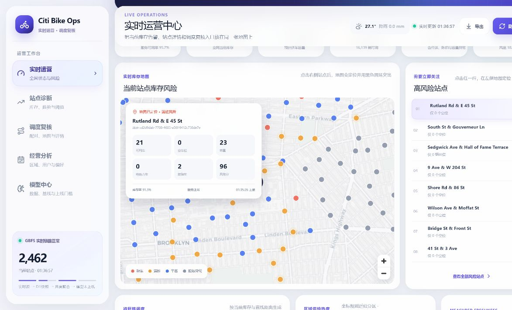
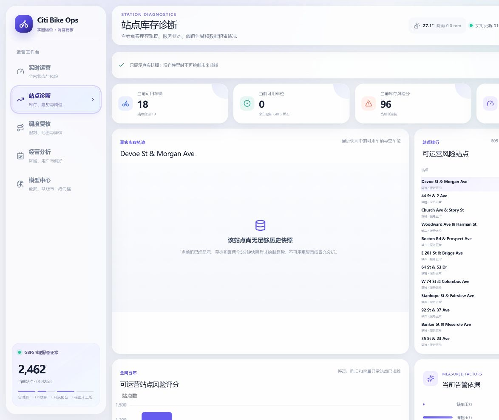
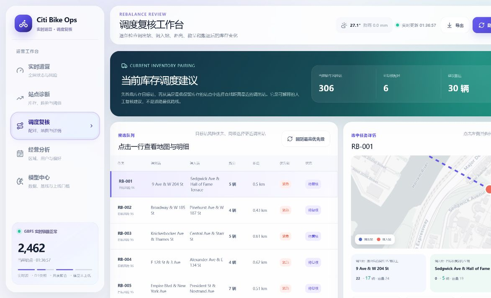
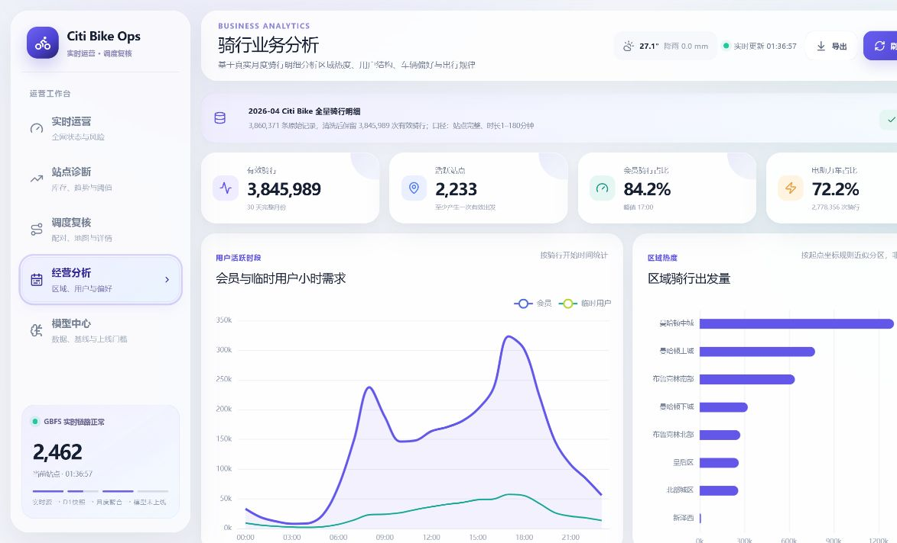
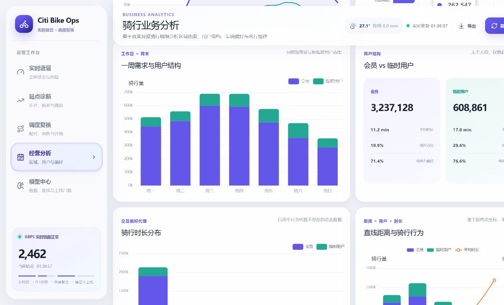
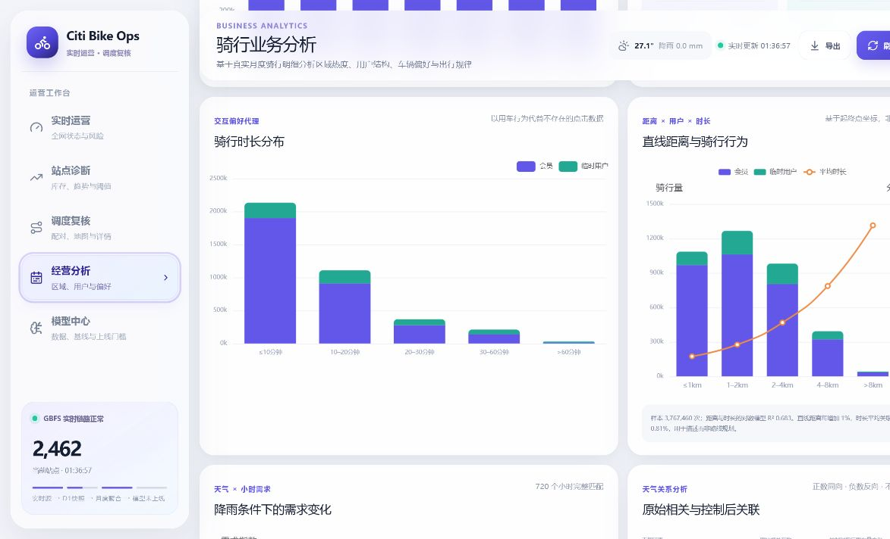
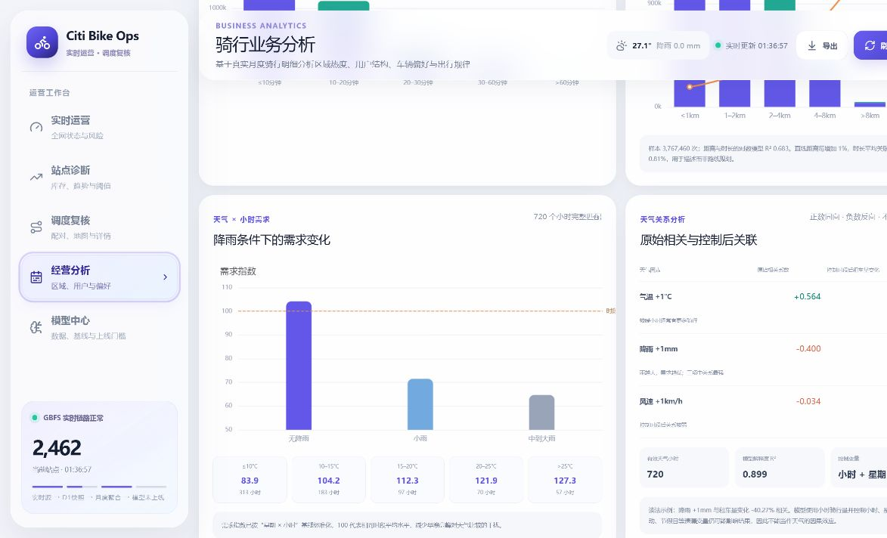
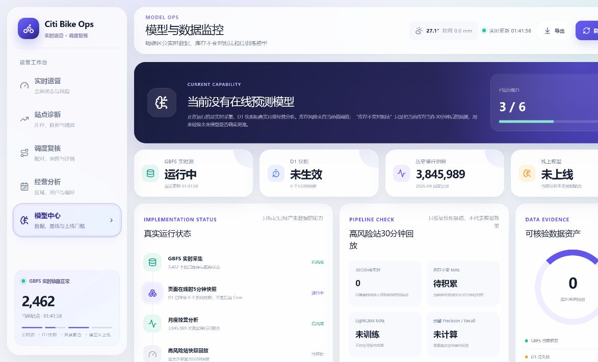
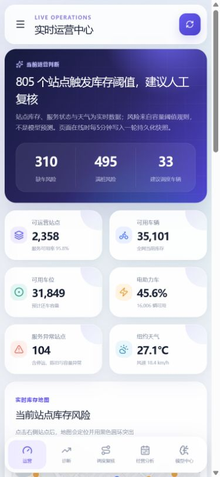
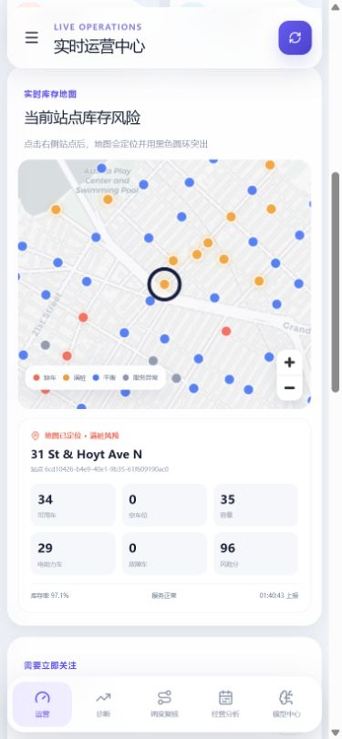

# Citi Bike Operations Monitor

面向共享单车运营场景的实时库存监控、站点诊断与调度复核系统。

系统从 Citi Bike 官方 GBFS 获取最新站点库存与服务状态，结合天气、站点容量和距离规则，帮助运营人员回答三个问题：**哪里已经缺车或满桩、为什么需要关注、应该优先复核哪组调度配对。**

> [在线体验](https://citibike-operations-monitor.onrender.com) · [GitHub 仓库](https://github.com/xppdxkj/citibike-operations-monitor)
> Render 免费实例闲置后会休眠，首次打开可能需要约一分钟；实时数据出现后，地图与站点图层会自动加载。

## 项目概览

| 项目维度 | 当前实现 |
| --- | --- |
| 实时数据 | Citi Bike GBFS 站点状态、车辆类型与服务状态；Open-Meteo 当前天气 |
| 历史样本 | 2026-04 月度骑行明细，3,860,371 条原始记录，清洗后 3,845,989 次有效骑行 |
| 运营决策 | 库存风险识别、站点下钻、富余站匹配、建议搬运数量与人工审批 |
| 多维分析 | 区域、用户、车型、时段、距离、时长、路线与天气关系 |
| 公开部署 | GitHub + Render Node Web Service，服务端代取境外数据源 |
| 能力边界 | 当前使用可解释规则，不把规则告警包装成机器学习预测或道路路径优化 |

## 3 分钟核验路径

1. 打开“实时运营”，等待顶部状态显示最新更新时间并确认地图站点点位出现；
2. 点击右侧高风险站点，核对地图黑色选中环、站点名称、库存和风险分是否同步；
3. 进入“调度复核”，打开任一候选任务，检查调出/调入站、距离、数量及搬运后库存模拟；
4. 进入“经营分析”，查看距离、天气、用户和车型等维度的样本量、统计关系与解释边界；
5. 进入“模型中心”，确认已运行能力、待实现能力和数据资产状态没有被混写。

## 业务闭环

```text
官方实时状态 + 天气
        ↓
数据时效、容量与服务状态校验
        ↓
缺车 / 满桩 / 停运 / 陈旧数据识别
        ↓
站点地图定位与库存明细下钻
        ↓
缺车目标站 × 富余调出站配对
        ↓
调度数量、距离、搬运前后库存模拟
        ↓
运营人员批准 / 驳回 / 继续复核
```

## 功能实景

以下截图均来自公开部署，截图前已确认 GBFS 实时链路、地图瓦片和站点图层完成加载。实时数值会随 Citi Bike 状态变化；点击图片可在 GitHub 中查看原图。

### 1. 实时库存风险地图

地图同时展示缺车、满桩、平衡和服务异常站点。点击风险排行后，地图会移动到对应站点，并通过黑色圆环、库存卡片和站点 ID 明确突出当前选择。



### 2. 站点库存诊断

站点诊断展示当前车辆、空车位、容量阈值、风险分和全网风险排行。公开 Render 版本没有持续快照数据库，因此页面明确说明轨迹不可用，不再使用重复直线冒充预测或历史趋势。



### 3. 调度复核工作台

每个候选任务都可以查看调出站、调入站、建议数量、直线距离、风险优先级、配对地图及搬运前后库存变化，并支持批准或驳回。



### 4. 多维经营分析

月度分析基于清洗后的 3,845,989 次有效骑行，覆盖需求时段、区域热度、会员与临时用户、车型偏好、骑行距离、时长和天气关系。









### 5. 模型与数据状态

模型中心只标记真正产生数据的能力：实时采集和月度分析已经运行；Render 端持续快照、在线预测模型和正式 Precision / Recall 尚未实现。



### 6. 手机端适配

手机端重新组织了导航、指标卡、地图、站点详情和调度任务，不是简单缩放桌面页面。

<table>
  <tr>
    <td width="50%"></td>
    <td width="50%"></td>
  </tr>
  <tr>
    <td align="center">运营总览</td>
    <td align="center">地图与站点详情</td>
  </tr>
</table>

## 已验证的分析结论

| 分析主题 | 结果 | 解释边界 |
| --- | --- | --- |
| 用户结构 | 会员贡献 84.17% 骑行；临时用户平均时长 17.8 分钟，高于会员的 11.2 分钟 | 群体级行为，不包含个人 ID |
| 车型偏好 | 电助力车占 72.24% 骑行；临时用户电助力偏好为 76.58% | 只代表 2026-04 样本 |
| 区域热度 | 曼哈顿中城贡献 33.93% 出发量，晚高峰 17:00 达峰 | 区域由坐标规则近似划分 |
| 距离与时长 | 3,767,460 次样本中，对数模型 R² 为 0.683；直线距离每增加 1%，时长平均关联增加 0.81% | 距离为起终点直线距离，不是道路里程 |
| 降雨与需求 | 控制星期和小时后，降雨每增加 1 mm 与小时租车量下降 40.27% 相关 | 统计关联，不等同于因果效应 |
| 天气模型 | 720 个小时完整匹配；控制模型 R² 为 0.899 | 用于描述历史关系，不是未来预测服务 |

## 已实现能力与边界

| 能力 | 状态 | 说明 |
| --- | --- | --- |
| GBFS 实时采集 | 已运行 | 服务端获取约 2,400 个站点的车辆、车位、故障车和服务状态 |
| 实时地图与联动 | 已运行 | 同源瓦片代理、风险点、选中圆环、排行与站点详情联动 |
| 可解释库存告警 | 已运行 | 只使用最新容量、车辆、空位和服务状态 |
| 调度候选与复核 | 已运行 | 生成调出/调入站、数量、距离和搬运后库存模拟 |
| 月度多维分析 | 已运行 | 由真实月度明细和 720 小时天气数据离线聚合 |
| Cloudflare D1 快照 | 代码已支持 | Cloudflare 部署可绑定 D1；当前 Render 公开版本未绑定 |
| 24×7 后台采集 | 未实现 | 当前没有无人访问时持续运行的 Cron Worker |
| LightGBM 在线预测 | 未实现 | 没有训练、回测和部署，不展示虚构 MAE、Precision 或 Recall |
| 道路路径优化 | 未实现 | 当前使用经纬度直线距离，不声称为最短道路路线 |

## 风险与调度规则

- 缺车风险：可用车辆低于站点容量约 12%；
- 满桩风险：空车位低于站点容量约 12%；
- 调入目标：把缺车站恢复到约 28% 库存；
- 调出约束：搬运后调出站仍保留约 62% 库存；
- 配对顺序：优先处理风险更高的目标站，同级选择直线距离更近的富余站；
- 停运、陈旧和容量异常站点不进入可执行调度池。

这些结果用于运营人员复核，不是自动派单指令。

## 数据与技术架构

```text
Citi Bike GBFS ─┐
                 ├─→ Next.js 服务端接口 ─→ 校验与实时指标 ─→ 地图 / 告警 / 调度复核
Open-Meteo ─────┘                 │
                                  └─→ Cloudflare 环境可写入 D1 快照

Citi Bike 月度明细 ─→ Python 清洗与聚合 ─→ trip-analytics.json ─→ 多维经营分析
```

| 层次 | 技术 |
| --- | --- |
| 前端 | React 19、TypeScript、ECharts、MapLibre GL |
| 服务端 | Next.js 16、vinext、Node.js / Cloudflare Workers |
| 数据 | Citi Bike GBFS、月度骑行明细、Open-Meteo |
| 存储 | Cloudflare D1、Drizzle ORM；Render 版本为无状态服务 |
| 分析 | Python、清洗聚合、分层统计与控制变量回归 |
| 工程 | pnpm、ESLint、Node Test Runner、Render Blueprint |

## API

| 路径 | 用途 |
| --- | --- |
| `GET /api/live` | 获取 GBFS 站点、天气、区域指标和实时风险输入 |
| `GET /api/analytics` | 查询系统快照、站点轨迹和基线回放；未绑定数据库时返回明确状态 |
| `GET /api/map-tiles/{z}/{x}/{y}` | 服务端代理地图瓦片，减少移动端跨域 CDN 加载问题 |

## 本地运行与验证

环境要求：Node.js `>=22.13.0`，建议使用 pnpm。

```bash
git clone https://github.com/xppdxkj/citibike-operations-monitor.git
cd citibike-operations-monitor
pnpm install --frozen-lockfile
pnpm dev
```

提交前验证：

```bash
pnpm lint
pnpm test
```

`pnpm test` 会执行生产构建，并检查实时数据链路、地图代理、分析数据和关键交互契约。

<details>
<summary><strong>项目结构</strong></summary>

```text
├── analytics/                 # 月度骑行与天气分析脚本
├── app/
│   ├── api/live/              # GBFS、天气、状态校验与快照写入
│   ├── api/analytics/         # 系统和站点历史查询
│   ├── api/map-tiles/         # 同源地图瓦片代理与备用源
│   ├── page.tsx               # 五个业务模块及交互
│   └── globals.css            # 桌面、平板和手机响应式样式
├── db/                        # D1 数据访问层
├── drizzle/                   # 数据库迁移
├── public/data/               # 可复核的历史聚合结果
├── tests/                     # 构建产物与数据链路测试
├── render.yaml                # Render 免费服务部署配置
└── worker/                    # Cloudflare Worker 入口
```

</details>

## 部署说明

当前公开版本通过 `render.yaml` 部署到 Render：

- 浏览器只访问 Render 域名，Citi Bike、天气和地图上游资源由服务端代取；
- 免费实例闲置后会休眠，首次请求可能延迟 50 秒以上；
- Render 版本没有 D1，因此历史实时快照和 30 分钟回放会显示为不可用；
- 若需要 24×7 采集、稳定的中国大陆访问和正式模型监控，需要增加常驻 Worker、持久化数据库及更合适的部署区域或自有域名。

## 数据来源与口径

- [Citi Bike System Data](https://citibikenyc.com/system-data)：GBFS 实时状态与月度骑行明细；
- [GBFS Specification](https://gbfs.org/documentation/reference/)：共享出行实时数据规范；
- [Open-Meteo](https://open-meteo.com/en/docs)：当前与历史天气。

原始月度压缩包体积较大，不提交到 GitHub。仓库只保留分析脚本和网页使用的聚合结果 `public/data/trip-analytics.json`。

本项目与 Citi Bike、Lyft、Open-Meteo 无官方隶属关系。页面中的风险、区域和天气结果均受当前数据质量、所选月份和分析口径限制。

## License

代码用于个人作品展示与学习。使用数据时请同时遵守各数据提供方的条款和署名要求。
